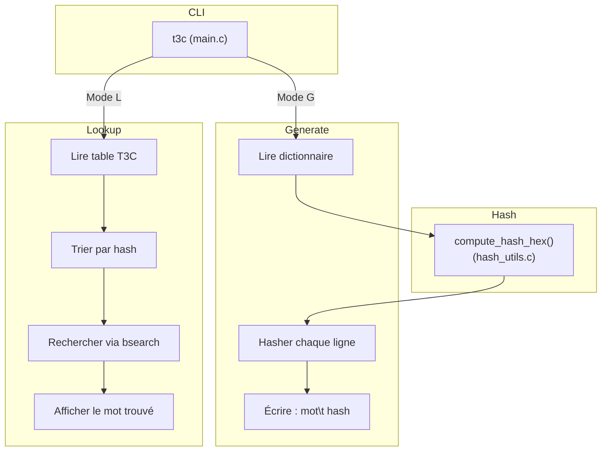

# Table de Correspondance Chaine-Condensat (T3C)

## Description :
Programme en C permettant de :
- **Générer** une table de correspondance (mot → hash) à partir d’un dictionnaire (Mode G),
- **Rechercher** un mot à partir d’un hash dans cette table (Mode L).

## Fonctionnalités :
### Mode G — Génération de condensats
Lit un dictionnaire texte contenant un mot de passe par ligne (\n comme séparateur).
Calcule un condensat pour chaque mot (MD5, SHA1, SHA256, etc. via OpenSSL).
Écrit la table de correspondance (T3C) dans un fichier texte au format : mot_de_passe<TAB>hash

### Mode L — Recherche dans une table T3C
Charge une table T3C existante en mémoire.
Trie les entrées par hash (qsort) pour permettre une recherche rapide.
Recherche (binaire) un ou plusieurs condensats :
Soit via un argument (t3c L table.t3c hash),
Soit via l’entrée standard (plusieurs lignes de hash sur stdin).

### Algorithmes de hachage supportés
Utilise de façon dynamique les algorithmes de hachage fournis par OpenSSL (EVP).
Vous pouvez spécifier l’algorithme en argument (ex: md5, sha1, sha256, sha512, etc.).
Par défaut, SHA256 est utilisé si l’algorithme n’est pas spécifié ou inconnu.


## Architecture du projet
src/
├─ t3c.h           # Définitions globales, structures et prototypes
├─ main.c          # Gestion des arguments et modes
├─ hash_utils.c    # Fonctions de hachage (OpenSSL EVP)
├─ mode_generate.c # Mode G : génération des condensats
├─ mode_lookup.c   # Mode L : chargement, tri, recherche rapide
Makefile
README.md





## Dépendances
Le programe utilise uniquement des paquets standards Debian.

- `gcc`, `make`, `libssl-dev` (pour `-lcrypto`)
- OU simplement **Docker**

## Compilation
Pour compiler le programme `t3c`, vous pouvez utiliser l'une des méthodes suivantes :

```shell
# Localement si vous avez les dépendances installés
make

# Dans l'image Docker qui inclue les dépendances.
sudo docker run --rm -ti -v "$(realpath .):/usr/src/myapp -w /usr/src/myapp gcc:12 make
```

## Exécution :
### Génération de la table de correspondance (Mode G)
```shell
./t3c G <fichier_dictionnaire> <fichier_sortie_T3C> [algorithme]
#./t3c G rockyou.txt table.t3c sha256
```

### Recherche dans la table de correspondance (Mode L)
```shell
# à partir d'un hash en argument
./t3c L <fichier_T3C> [hash]
#./t3c L table.t3c 8c6976e5b5410415bde908bd4dee15dfb167a9c873fc4bb8a81f6f2ab448a918

# ou à partir d'une entrée standard
printf "[hash]\n[hash2]\n" ./t3c L <fichier_T3C>
#echo 8c6976e5b5410415bde908bd4dee15dfb167a9c873fc4bb8a81f6f2ab448a918 | ./t3c -l -i table.t3c
```
